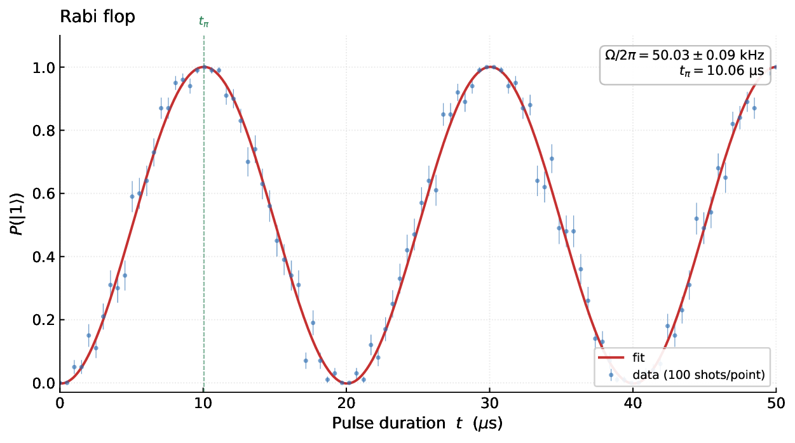
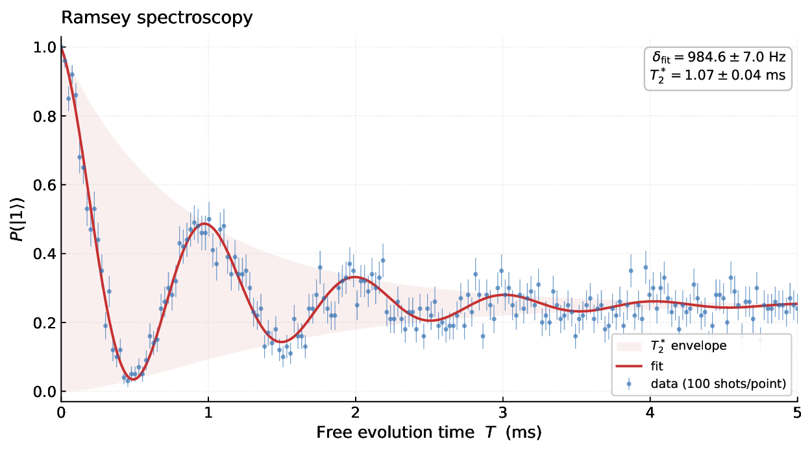
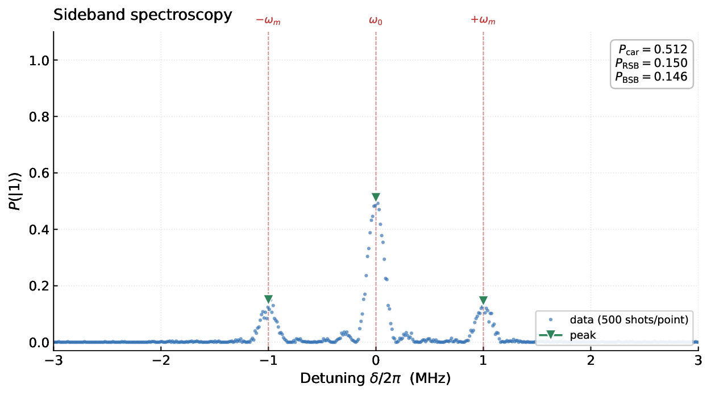
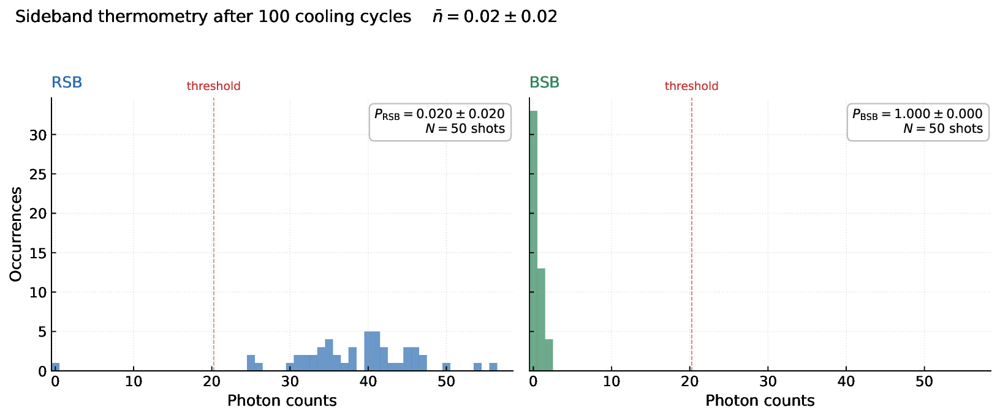
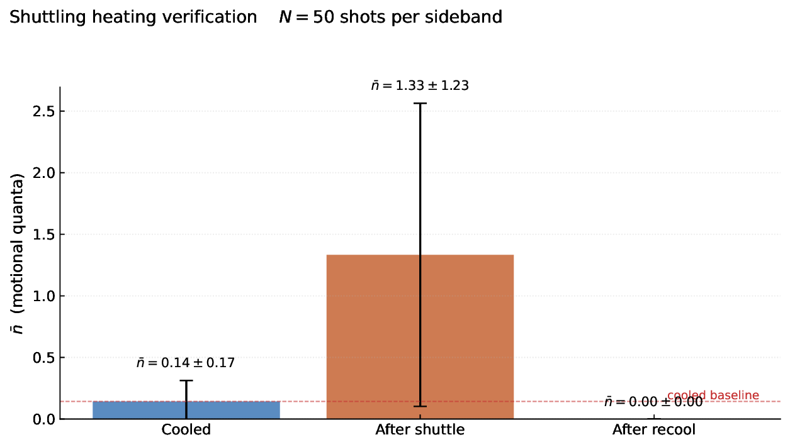
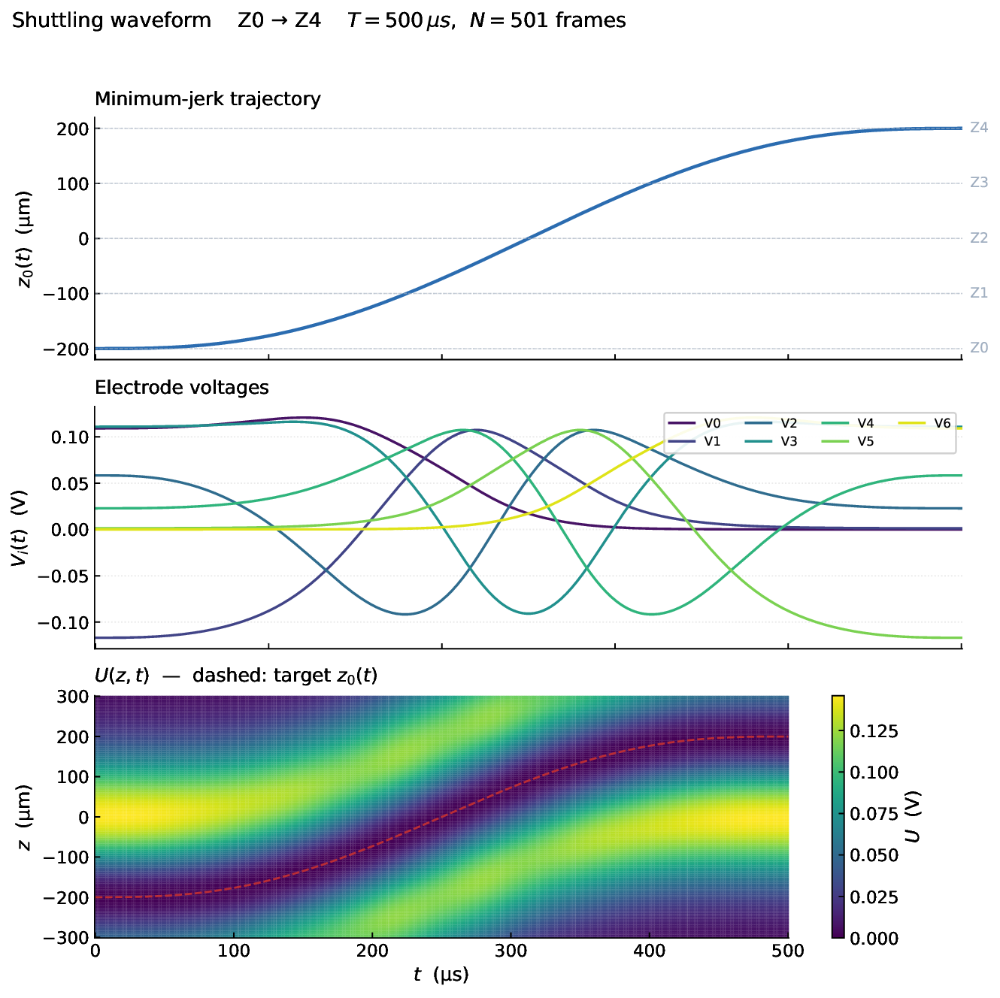
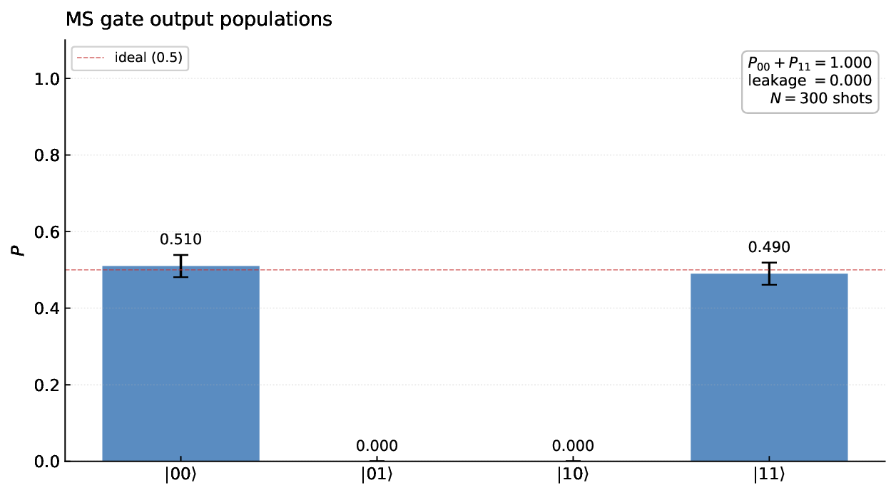

# Qubit Control

A trapped-ion quantum control stack built on [ARTIQ](https://m-labs.hk/artiq/), targeting a Ca⁺ chain. The codebase implements the full path from single-ion Rabi flopping to a two-ion Mølmer–Sørensen entangling gate, and runs end-to-end against a QuTiP-based simulator that mirrors the real ARTIQ device APIs.

## Demonstrated experiments

Seven trapped-ion experiments, each runnable end-to-end against the simulator with `artiq_run`. The figure under each entry is the output of that experiment's own `analyze()` method; the full vector PDF is linked alongside.

### Fluorescence check — `fluorescence_check.py`

PMT counting with bright/dark discrimination via Poisson statistics. Used as a state-readout primitive by every other experiment. No standalone plot.

### Rabi flop — `rabi_flop.py`

Carrier Rabi oscillation on the qubit transition. Fits Ω_Rabi and t_π from the population-vs.-pulse-duration scan.



[Full PDF →](docs/rabi_flop.pdf)

### Ramsey spectroscopy — `ramsey_spectroscopy.py`

Two π/2 pulses bracketing a variable free-evolution interval. Reveals coherent phase accumulation at the laser–resonance detuning and exponential T₂* decay of the fringe contrast.



[Full PDF →](docs/ramsey_spectroscopy.pdf)

### Sideband spectroscopy — `sideband_spectroscopy.py`

Frequency scan across the carrier showing red and blue motional sidebands at ±ω_sec. The sideband-ratio asymmetry gives a thermometry estimate of n̄.



[Full PDF →](docs/sideband_spectroscopy.pdf)

### Sideband cooling — `sideband_cooling.py`

Resolved-sideband cooling on the red sideband, interleaved with optical pumping. Tracks n̄ from its Doppler-cooled starting value down toward the motional ground state.



[Full PDF →](docs/sideband_cooling.pdf)

### Shuttling — `shuttling.py`

Multi-zone ion transport across a segmented trap. Routes and per-route heating are driven from the YAML config in `config/`. Each route plays back a precomputed DAC waveform frame-by-frame through the ARTIQ kernel — see the Waveform generation entry below.



[Full PDF →](docs/shuttling.pdf)

### Waveform generation — `sim/waveform_gen.py`

Solves for the time-dependent electrode voltages that move the trap minimum smoothly between zones in a 7-electrode / 5-zone linear segmented Paul trap. Each electrode contributes a Gaussian basis function `φ_i(z)`, and the per-frame voltage vector is found by a Tikhonov-regularized least-squares fit to three constraints at the desired well position: `U(z₀) = 0`, `U'(z₀) = 0`, `U''(z₀) = m·ω²/e`. The trajectory `z₀(t)` is a minimum-jerk quintic (continuous velocity and acceleration at both endpoints) to avoid impulsive kicks. Running the module sweeps all 20 routes defined in `routes.yaml` and writes one `.npy` per route into `config/waveforms/`, which the `TrapDCModule` then plays back through `Zotino`-style `set_dac` calls inside an `@kernel` loop.



[Full PDF →](docs/waveform_z0_to_z4.pdf)

### Mølmer–Sørensen gate — `ms_gate.py`

Two-ion entangling gate via simultaneous red/blue sideband drive detuned from the secular frequency.



[Full PDF →](docs/ms_gate.pdf)

### Quantum error correction - `qec_x_check.py`

Error correction for bitflips occuring in a logical qubit consisting of 3 real qubits. The error is introduced artificially by flipping one qubit, then detected with ancilla qubits and finally corrected.


[Full PDF →](docs/qec_x_check.pdf)

## Installation

The project pins all dependencies (ARTIQ release-9, NumPy, SciPy, QuTiP, Matplotlib, h5py, PyYAML) through Nix, so the only prerequisite is a working Nix installation with flakes enabled. The following installation was testet on Ubuntu 22.04 LTS.

```bash
git clone https://github.com/SATheinen/trapped-ion-artiq.git
cd trapped-ion-artiq

bash setup.sh

. "$HOME/.nix-profile/etc/profile.d/nix.sh"
```

Every time entering the shell you have to start nix develop with the flag

```bash
nix develop --accept-flake-config
```

The flake targets `x86_64-linux`. On macOS or other systems you will need either a Linux VM or to substitute the inputs in `flake.nix`. The M-Labs binary cache is configured in `nixConfig`, so the ARTIQ build should not need to compile from source.

## Running an experiment

All experiments are standard ARTIQ `EnvExperiment` classes and run through `artiq_run` against the simulated device database:

```bash
artiq_run --device-db qubit_control/device_db_sim.py \
          qubitcore_control/experiments/rabi_flop.py
```
or
```bash
cd qubit_control
bash start_experiment.sh
```

Each experiment writes a dataset to HDF5 and produces a PDF plot via its `analyze()` method.

To run against real hardware, populate `qubit_control/device_db.py` with the matching device entries. The experiment code does not change.

## File organization

The codebase is intentionally split into four layers so that the simulator and the hardware-facing code remain isolated. Nothing under `system/` or `experiments/` imports from `sim/` — the connection is made only through the device database.

```
qubit_control/
├── device_db.py            # real-hardware device map (empty placeholder)
├── device_db_sim.py        # simulator device map — points at sim/ classes
│
├── experiments/            # top-level EnvExperiment classes
│   ├── fluorescence_check.py
│   ├── rabi_flop.py
│   ├── ramsey_spectroscopy.py
│   ├── sideband_spectroscopy.py
│   ├── sideband_cooling.py
│   ├── shuttling.py
│   └── ms_gate.py
│
├── system/                 # hardware abstractions — run on both sim and real
│   ├── modules/            # thin wrappers around one device each
│   │   ├── laser_729.py    #   qubit laser (DDS)
│   │   ├── laser_397.py    #   Doppler / detection laser
│   │   ├── detection.py    #   PMT TTL counter
│   │   └── trap_dc.py      #   shuttling DAC waveforms
│   └── services/           # higher-level sequences composed from modules
│       ├── cooling.py      #   Doppler + optical pumping
│       ├── gate_service.py #   MS gate, dual-frequency drive
│       └── ion_shuttling.py
│
├── config/                 # central physics + hardware parameters
│   ├── __init__.py         #   constants (Ω, ω_sec, η, T₂*, INTERACTION_ZONE, …)
│   ├── loader.py           #   YAML-backed trap zone / route config
│   ├── routes.yaml         #   5-zone trap layout + per-route durations + waveform refs
│   └── waveforms/          #   one .npy per route (generated by sim/waveform_gen.py)
│
└── sim/                    # pure-Python simulator — never imported by system/
    ├── core.py             #   SimCore — replaces ARTIQ core device
    ├── devices.py          #   SimDDS729, SimPMT, SimDCElectrodes — mirror real APIs
    ├── ion_chain.py        #   QuTiP state vector, mesolve, fluorescence model
    ├── trap_module.py      #   7-electrode Gaussian basis + regularized voltage solver
    └── waveform_gen.py     #   minimum-jerk trajectory → per-frame voltage tables
```

### The simulator / software boundary

The pattern that makes the rest of the codebase work is in the two device DBs. `device_db_sim.py` maps logical device names (`core`, `dds_729`, `ttl_pmt`, `dac_dc`, …) to `Sim*` classes that expose the same method signatures as their ARTIQ counterparts. `device_db.py` will eventually map the same names to real ARTIQ device entries.

Because `system/modules/` and `system/services/` only ever see device handles via `self.dds`, `self.pmt`, etc., they do not know, whether they are talking to a simulator or to real hardware. The `@kernel` decorators are no-ops in simulation but compile to FPGA execution on real hardware, so the same source file is correct in both worlds.

The simulator itself lives behind that boundary. `IonChain` holds the full QuTiP state (`N_IONS` tensor product, motional mode bookkeeping, position vector), and `SimDDS729` / `SimPMT` translate ARTIQ-level calls (`set_frequency`, `pulse`, `count`) into rotations, free evolutions, and Poisson-sampled photon counts on that state.

## Capabilities

- **End-to-end ARTIQ workflow** — every experiment is launched through `artiq_run`, uses `@kernel`-decorated sequences, writes HDF5 datasets, and performs its own curve fitting and PDF rendering in `analyze()`.
- **Sim/real parity** — switching between simulated and real hardware is a single command-line flag (`--device-db`). No experiment or system code branches on the backend.
- **Layered control stack** — modules wrap single devices, services compose modules into reusable physics primitives (cooling, MS gate, shuttling), and experiments stay short and readable.
- **Physically reasonable simulator** — QuTiP master-equation evolution with detuning, Rabi drive, T₂* dephasing, motional state tracking, Lamb-Dicke sideband coupling, and Poisson PMT statistics. Enough to make the fits in each experiment converge to the configured parameters.
- **Centralized configuration** — all physics constants live in `config/`, and trap zones / shuttling routes are loaded from YAML so that experiment code stays parameter-free.

## Limitations and honest caveats

- **No real-hardware validation.** `device_db.py` is an empty placeholder. Every result in this repo is from the simulator. The architecture is designed for parity, but parity has not been physically demonstrated.
- **Single-species, fixed parameters.** Only Ca⁺ at a single hard-coded set of operating parameters is modeled. There is no calibration routine — the "true" values in the simulator are also the values experiments are configured against.
- **One shared motional mode.** The simulator assumes all ions in a zone share a single common mode and tracks `n_bar` as a scalar. Multi-mode coupling and mode crosstalk are not modeled.
- **Phenomenological decoherence.** T₂* enters as an exponential damping factor on the off-diagonal element during free evolution rather than as a full Lindblad term integrated alongside the unitary. Good enough for Ramsey fits, not a substitute for real noise modeling.
- **Shuttling waveforms are physical but the ion dynamics in them are not.** Voltage waveforms are solved from a proper electrostatic basis with a minimum-jerk trajectory and played frame-by-frame through the simulated DAC, but transport-induced motional excitation is still applied as a per-route Poisson heating term rather than integrated from Newton's equation in the time-varying well.

## Further reading

- [ARTIQ manual](https://m-labs.hk/artiq/manual/) — official documentation for the framework.
- [QuTiP documentation](https://qutip.org/documentation.html) — used throughout the simulator.

## Contact

Silas Theinen — silas.theinen@t-online.de
